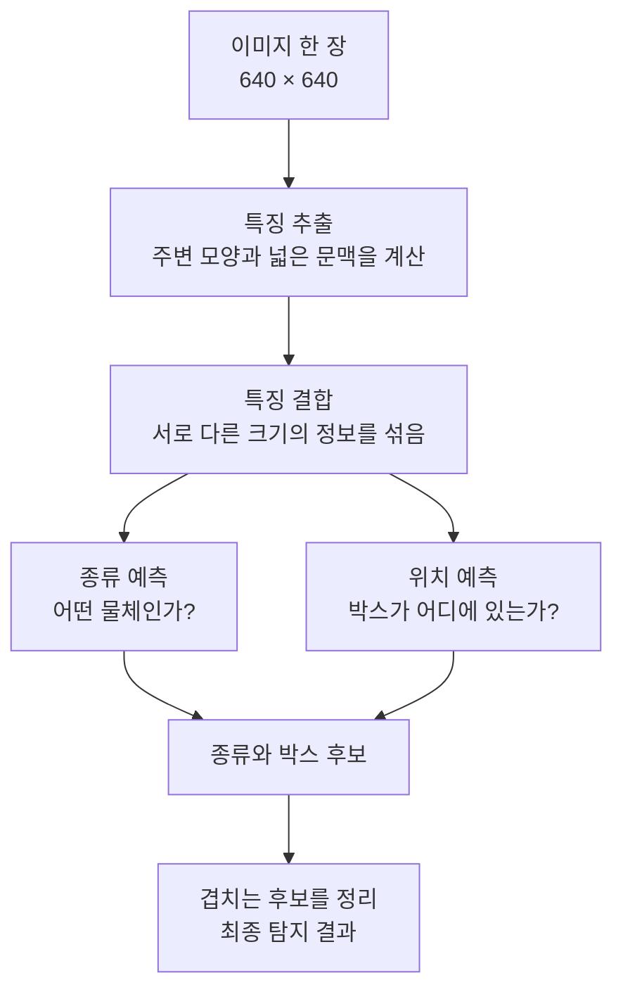
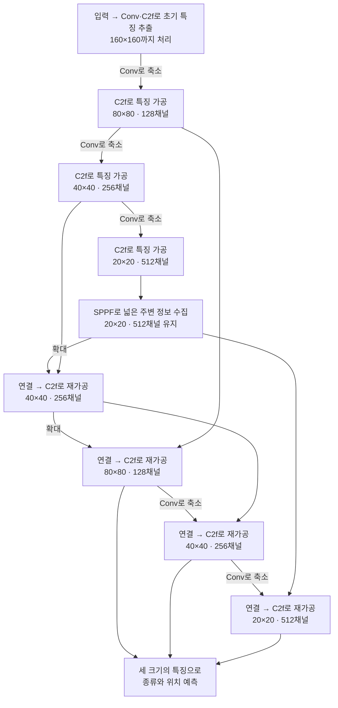

# YOLOv8 Small 구조 변경을 위한 안내서

## 개요 — 이 자료를 읽는 순서

우리의 목표는 **물체 탐지에 필요한 기능을 이해하고, 연산량을 줄일 구조 변경안을 설계하는 것**이다. 대상은 이 프로젝트의 YOLOv8 Small, 자동차·보행자·자전거 이용자 3종 탐지 모델이다.

| 읽는 순서 | 답해야 할 질문 | 읽고 나면 할 수 있는 일 |
|---|---|---|
| 1. 전체 구조 | 이미지가 어떤 순서로 처리되는가? | 특징 추출·결합·예측 흐름 설명 |
| 2. 구성 요소 | 각 연산이 왜 필요한가? | 줄였을 때 잃을 수 있는 기능 설명 |
| 3. YAML 읽기·수정 | 원하는 부분을 어디서 어떻게 바꾸는가? | 연결·반복·채널을 읽고 수정 범위 확인 |
| 4. Small 연산량 | 어느 부분의 계산이 큰가? | 역할과 비용을 함께 보고 변경 후보 판단 |

**우리가 제공하는 것은 1~4의 판단 근거다.** 팀원은 이를 바탕으로 변경 구조와 YAML을 제안하고, 학습·결과 측정은 요청자가 진행한다. 여기의 수정 예시는 문법 설명용이며 최종 설계안이 아니다.

> **용어:** 탐지는 물체의 종류와 위치를 함께 찾는 일이다. **YAML**은 모델의 구성과 연결을 적는 설정 파일 형식이다. **연산량**은 계산 횟수이며, 실제로 걸린 시간과 다르다.

## 1. 전체 구조 — 특징을 만들고, 섞고, 예측한다

### 1.1 먼저 큰 흐름 보기



특징 추출에서 만든 정보를 세 크기로 유지하고, 결합 과정에서 서로 전달한다. 예측도 세 크기에서 수행한다. 한 크기의 경로를 없애면 계산과 함께 그 경로가 전달하던 정보도 줄어든다.

> **용어:** **특징 맵**은 이미지의 각 위치를 숫자로 표현한 중간 결과다. 특징 추출 부분은 **Backbone**, 결합 부분은 **Neck**, 종류·위치 예측 부분은 **Detect**라고 부른다. 박스는 물체를 감싸는 사각형이다. 겹치는 후보를 정리하는 후처리가 **NMS**다.

### 1.2 Small에서 정보가 연결되는 순서

아래는 주요 연결과 **C2f·SPPF가 사용되는 위치**를 보여준다. 특징 추출에서는 Conv로 공간 크기를 줄인 뒤 C2f로 가공하고, 특징 결합에서는 두 경로를 연결한 뒤 C2f로 다시 가공한다. SPPF는 가장 성긴 20×20 특징을 가공한 다음에 한 번 사용한다. 개별 연산은 2절, 정확한 YAML 연결은 3절에서 확인한다.



그림에서 C2f와 SPPF의 역할은 다음처럼 이어진다.

| 사용 위치 | 하는 일 | 다음으로 전달하는 정보 |
|---|---|---|
| 특징 추출의 C2f | Conv가 만든 특징을 반복 가공 | 각 크기에서 물체를 구분하는 데 사용할 특징 |
| 특징 추출 끝의 SPPF | 20×20 특징에서 여러 범위의 주변 정보를 모음 | 공간 크기를 유지하면서 넓은 문맥을 반영한 특징 |
| 특징 결합의 C2f | 서로 다른 경로에서 연결된 특징을 다시 가공 | 종류·위치 예측에 사용할 세 크기의 특징 |

즉, **C2f는 특징을 가공하는 역할로 여러 곳에서 쓰이고, SPPF는 특징 추출 끝에서 주변 문맥을 모으는 역할로 쓰인다.** SPPF의 출력은 확대 경로와 마지막 20×20 결합 경로 양쪽으로 전달된다.

> **용어:** **C2f**는 일부 특징을 남기고 일부를 반복 가공한 뒤 합치는 블록이다. **SPPF**는 주변의 큰 값을 여러 범위에서 모으는 블록이다. **연결(Concat)**은 같은 공간 크기의 특징을 채널 방향으로 이어 붙이는 연산이다. 그림의 **Conv**는 주변 값과 채널을 조합하며, 축소 지점에서는 가로·세로를 절반으로 줄인다.

80×80은 위치가 가로·세로 80개씩 있다는 뜻이다. 촘촘한 특징은 세밀한 위치를 표현하는 데, 성긴 특징은 넓은 문맥을 전달하는 데 도움이 된다. 다만 각 경로가 특정 물체 크기만 담당하도록 고정된 것은 아니다.

> **용어:** **채널**은 한 위치를 표현하는 특징의 개수다. `128채널·80×80`은 각 위치에 128개의 특징 값이 있다는 뜻이다. **P3/P4/P5**는 이 모델에서 각각 80×80 / 40×40 / 20×20 단계를 가리킨다. 그림에는 이 약어 대신 크기를 적었다.

## 2. 구성 요소 — 계산, 역할, 변경 시 영향

### 2.1 Conv: 주변 정보로 새로운 특징을 만든다

작은 필터를 이동시키며 주변 값에 가중치를 곱하고 더한다. 3×3 Conv는 주변 모양과 채널을 함께 조합하고, 1×1 Conv는 같은 위치에서 채널을 조합한다. 채널을 줄이면 계산은 줄지만 표현할 특징도 줄 수 있다. 공간 크기를 줄이는 Conv를 삭제하면 다음 연결의 크기가 맞지 않을 수 있다.

> **용어:** **Conv(합성곱)**는 위 계산을 뜻한다. **필터/커널**은 가중치 묶음이며 3×3은 주변 9개 위치를 본다는 뜻이다. 가중치는 학습으로 정해지는 숫자다. **stride**는 필터의 이동 간격이며 이 구조에서 stride=2는 가로·세로를 절반으로 줄인다.

이 프로젝트의 `Conv` 블록에는 보통 다음 세 연산이 들어간다.

| 구성 | 하는 일 | 이해할 점 |
|---|---|---|
| Conv2d | 주변 값과 입력 채널을 조합 | 주로 분석할 곱셈·덧셈 비용 |
| BatchNorm | 채널별 값의 중심·크기를 정규화하고 조절 | 학습을 돕는 단계. 추론에서는 저장된 통계 사용 |
| SiLU | 각 값을 부드럽게 비선형 변환 | 복잡한 패턴을 표현하도록 도움 |

> **용어:** **블록**은 여러 연산을 묶은 단위다. **BatchNorm**은 배치 정규화다. **SiLU**는 활성화 함수로, 일정한 비율로 곱하고 더하는 것만으로 표현되지 않는 변환을 한다. 추론은 학습된 모델로 예측하는 과정이다. 추론 시 BatchNorm을 Conv 가중치에 합치는 **fusion**이 가능하지만 SiLU까지 사라지는 것은 아니다.

### 2.2 C2f: 가공 정도가 다른 특징을 함께 사용한다

`채널 분할 → 일부 특징 반복 가공 → 원래 특징과 중간 결과 연결 → Conv로 정리` 순서다. 특징 추출과 특징 결합 양쪽에서 사용한다. 반복을 줄이면 계산이 줄지만 특징을 구분하는 능력이 달라질 수 있다. 전체 삭제보다 내부 반복·채널 조정의 영향을 먼저 분리해 생각할 수 있다.

> **용어:** **C2f**는 위 분할·가공·결합 구조의 이름이다. 내부 반복 단위인 **Bottleneck**에는 여기서 3×3 Conv 두 개가 들어간다. **shortcut**은 조건이 맞을 때 입력을 결과에 더하는 연결이다. 기준 모델은 Backbone의 C2f에 shortcut을 사용하고 Neck의 C2f에는 사용하지 않는다.

### 2.3 SPPF: 더 넓은 주변 문맥을 모은다

특징 추출 끝에서 주변의 큰 값을 고르는 연산을 연속 적용한다. 좁게 본 결과와 넓게 본 결과를 모아 Conv로 정리한다. 공간 크기는 20×20으로 유지된다. 내부 채널이나 경로를 줄이면 비용이 줄 수 있지만 넓은 문맥을 전달하는 기능도 달라진다.

> **용어:** **SPPF**는 여러 범위의 주변 정보를 모으는 블록이다. **MaxPool**은 주변 최댓값을 고르는 연산으로, 여기서는 5×5 MaxPool을 연속 3회 사용한다. 이는 원본 이미지가 아니라 특징 맵 위의 범위다.

### 2.4 Upsample·Concat: 크기를 맞추고 정보를 연결한다

Upsample은 성긴 특징을 확대하고, Concat은 같은 공간 크기의 특징을 채널 방향으로 연결한다. 뒤의 C2f가 연결된 정보를 다시 가공한다. 경로를 줄이면 뒤 Conv도 저렴해질 수 있지만 다른 크기의 정보를 전달받지 못하게 된다. 연결을 바꿀 때는 공간 크기와 채널 수를 함께 확인해야 한다.

> **용어:** **Upsample**은 특징 맵 확대다. 여기서는 가까운 값을 복사하는 **nearest** 방식을 사용하며 새로운 세부 정보를 복원하지 않는다. **Concat**은 값을 더하지 않고 채널 방향으로 이어 붙인다.

### 2.5 Detect: 종류와 위치를 별도로 계산한다

세 크기의 특징 각각에 종류 예측과 박스 위치 예측 경로를 적용한다. 중간 채널을 줄이는 변경은 가능하지만 두 경로 중 하나를 없애면 탐지에 필요한 종류 또는 위치를 얻지 못한다. 80×80 예측 경로 전체를 없애는 변경은 작은 물체의 손실도 확인해야 한다.

> **용어:** **분기**는 서로 다른 계산을 하는 갈래다. **분류**는 물체 종류 예측, **박스 회귀**는 위치·크기 같은 수치 예측이다. **DFL**은 이 모델의 위치 예측에서 여러 구간에 대한 값을 실제 거리로 변환하는 계산에 쓰인다. 코드 내부의 `cv2`는 박스 분기, `cv3`는 분류 분기다.

## 3. YAML — 그림의 구조를 실제로 바꾸는 방법

### 3.1 한 줄을 읽는 규칙

각 줄은 `[from, repeats, module, args]`다. 아래 예시는 기준 모델의 특징 추출 C2f 한 줄이다.

```yaml
- [-1, 6, C2f, [256, True]]
```

| 항목 | 의미 | 이 예시의 해석 |
|---|---|---|
| from | 입력을 받을 위치 | -1: 직전 출력 |
| repeats | 배율 적용 전 반복 수 | 6: Small 배율 적용 후 C2f 내부 반복 2회 |
| module | 사용할 블록 | C2f |
| args | 해당 블록의 설정 | 기준 출력 채널 256, shortcut 사용 |

> **용어:** `True/False`는 사용/사용 안 함이다. 입력 번호는 **backbone과 head를 이어서 0부터** 센다. 예를 들어 4번은 다섯 번째 최상위 블록이며, P4나 채널 수와는 관계없다. 여러 입력은 `[-1, 6]`처럼 목록으로 적는다.

### 3.2 설정값과 실제 크기는 다르다

```yaml
nc: 3
scales:
  s: [0.33, 0.50, 1024]
```

세 값은 **깊이 배율·채널 폭 배율·채널 상한**이다. 현재 코드에서는 반복 수가 1보다 크면 `max(round(반복 수×0.33), 1)`을 적용한다. 일반 Conv·C2f·SPPF의 출력 채널은 `min(설정 채널, 1024)×0.50`을 계산한 뒤 8의 배수로 올림한다.

따라서 위 C2f는 **출력 128채널·내부 반복 2회**다. 반복 설정 3은 실제 1회이므로 3→2로 고쳐도 실제 반복은 그대로일 수 있다. Concat·Detect 등은 별도 규칙으로 채널이 정해지므로 이 공식을 모든 줄에 적용하지 않는다.

> **용어:** **깊이**는 반복 처리의 수, **폭**은 채널 수다. `nc`는 탐지할 종류 수이며 3을 유지한다. `s`는 Small 크기다. 이 프로젝트는 파일명으로 크기도 확인하므로 `yolov8s_아이디어.yaml`처럼 이름을 짓고 `scales.s`와 맞춘다.

### 3.3 실제 Small 구조와 연결

아래는 계산에 사용한 기준 구조다. 오른쪽 번호는 코드 위치를 찾는 참조이며 모델의 기능 이름이 아니다. `head:`에는 특징 결합과 최종 예측이 함께 들어간다.

```yaml
nc: 3
scales:
  s: [0.33, 0.50, 1024]

backbone:
  - [-1, 1, Conv, [64, 3, 2]]        # 0: 초기 특징
  - [-1, 1, Conv, [128, 3, 2]]       # 1
  - [-1, 3, C2f, [128, True]]        # 2
  - [-1, 1, Conv, [256, 3, 2]]       # 3: 80×80으로 축소
  - [-1, 6, C2f, [256, True]]        # 4: 80×80 특징
  - [-1, 1, Conv, [512, 3, 2]]       # 5: 40×40으로 축소
  - [-1, 6, C2f, [512, True]]        # 6: 40×40 특징
  - [-1, 1, Conv, [1024, 3, 2]]      # 7: 20×20으로 축소
  - [-1, 3, C2f, [1024, True]]       # 8
  - [-1, 1, SPPF, [1024, 5]]        # 9: 20×20 문맥 수집

head:
  - [-1, 1, nn.Upsample, [null, 2, nearest]] # 10: 40×40으로 확대
  - [[-1, 6], 1, Concat, [1]]               # 11: backbone의 40×40과 연결
  - [-1, 3, C2f, [512]]                     # 12: 연결 특징 가공
  - [-1, 1, nn.Upsample, [null, 2, nearest]] # 13: 80×80으로 확대
  - [[-1, 4], 1, Concat, [1]]               # 14: backbone의 80×80과 연결
  - [-1, 3, C2f, [256]]                     # 15: 80×80 예측용 특징
  - [-1, 1, Conv, [256, 3, 2]]              # 16: 40×40으로 축소
  - [[-1, 12], 1, Concat, [1]]              # 17: 앞의 결합 특징과 연결
  - [-1, 3, C2f, [512]]                     # 18: 40×40 예측용 특징
  - [-1, 1, Conv, [512, 3, 2]]              # 19: 20×20으로 축소
  - [[-1, 9], 1, Concat, [1]]               # 20: 문맥 특징과 연결
  - [-1, 3, C2f, [1024]]                    # 21: 20×20 예측용 특징
  - [[15, 18, 21], 1, Detect, [nc]]         # 22: 세 크기에서 종류·위치 예측
```

> **인자 읽기:** Conv의 `[채널, 커널 크기, stride]`, SPPF의 `[채널, pooling 커널 크기]`를 구분한다. Concat의 `[1]`은 채널 방향으로 연결한다는 뜻이다. Upsample의 `[null, 2, nearest]`는 고정 크기 대신 2배 확대를 지정한다. `nn.`은 PyTorch 기본 모듈을 가리킨다.

### 3.4 관찰에서 수정 아이디어와 결과까지

아래는 **역할·비용 관찰 → 아이디어 → YAML 변경 → 확인된 구조·연산량 결과 → 남은 검증** 순서의 예시다. 네 예시는 원본 Small에 **각각 하나씩만** 적용했다.

기준은 입력 640×640, 전체 Conv 연산량 **0.028437043 TFLOP(28.437043 GFLOP)**다. 변경 모델을 실제로 생성해 입력 한 장을 계산하고 연산량을 다시 집계했다. **학습 후 정확도와 실행시간은 측정하지 않았다.**

> **용어:** 표의 TFLOP/GFLOP는 이미지 한 장의 계산 횟수로, 1 TFLOP=1,000 GFLOP다. 여기서는 Conv의 곱셈·덧셈만 센다. **forward**는 입력에서 예측까지 한 번 계산하는 과정이다.

#### 예시 A. 같은 크기의 특징을 덜 반복해서 가공하면 어떨까?

**관찰 → 아이디어:** 특징 추출의 80×80 C2f(YAML 4번)는 내부 반복이 2회이고 2.517 GFLOP를 쓴다. 공간 크기와 출력 채널은 유지하면서 반복만 1회로 줄이면, 뒤의 연결을 바꾸지 않고 가공 깊이의 영향을 비교할 수 있다.

```yaml
# YAML 4번: 변경 전 → 변경 후
- [-1, 6, C2f, [256, True]]
- [-1, 3, C2f, [256, True]]
```

**확인된 결과:** 실제 반복은 **2→1회**, 출력은 **128채널·80×80 유지**다. 전체는 **0.027388467 TFLOP(27.388467 GFLOP)**로 **3.69% 감소**했다. 비용이 바뀐 최상위 블록은 4번뿐이다. 반복 감소에 따라 C2f 내부 마지막 Conv의 입력 채널도 줄어든 효과를 포함한다.

**남은 검증:** 가공이 줄어 작은 물체나 구분하기 어려운 물체를 놓치는지 확인한다. 출력 크기가 같다는 것이 정확도가 같다는 뜻은 아니다.

> **용어:** 가공 **깊이**는 반복 처리 횟수다. YAML의 6→3은 깊이 배율 0.33 적용 후 실제 2→1회가 된다.

#### 예시 B. 촘촘한 위치는 유지하고, 위치마다 쓰는 특징 수를 줄이면 어떨까?

**관찰 → 아이디어:** 같은 80×80 C2f에서 각 위치를 128채널로 표현한다. 작은 물체를 위한 공간 크기는 그대로 두고 출력 채널을 96개로 줄여, 특징의 폭을 줄이는 영향을 비교한다. 예시 A와 달리 반복은 유지한다.

```yaml
# YAML 4번: 변경 전 → 변경 후
- [-1, 6, C2f, [256, True]]
- [-1, 6, C2f, [192, True]]
```

**확인된 결과:** 실제 출력은 **128→96채널**, 내부 반복은 **2회 유지**다. 전체는 **0.027087002 TFLOP(27.087002 GFLOP)**로 **4.75% 감소**했다. 4번뿐 아니라 그 출력을 받는 **5번 Conv와, 결합 경로의 15번 C2f**도 입력 채널이 줄어 비용이 감소했다.

**남은 검증:** 공간 위치는 유지해도 각 위치의 표현 능력이 줄어든다. 종류별 탐지 정확도를 확인하며, 결과를 ‘4번 블록만의 비용 변화’로 해석하지 않는다.

> **용어:** 특징의 **폭**은 채널 수다. YAML의 출력 채널 192에 Small의 폭 배율 0.50이 적용되어 실제 96채널이 된다. 다음 블록의 입력 채널은 연결된 출력에서 정해진다.

#### 예시 C. 예측 직전 특징을 줄이면, 예측부 계산도 함께 줄어들까?

**관찰 → 아이디어:** 특징 결합의 80×80 C2f(YAML 15번)는 Detect와 다음 축소 경로에 정보를 전달한다. 이 출력의 폭을 줄이면 특징 가공 비용뿐 아니라 뒤의 예측 비용도 줄어들 수 있다.

```yaml
# YAML 15번: 변경 전 → 변경 후
- [-1, 3, C2f, [256]]
- [-1, 3, C2f, [192]]
```

**확인된 결과:** 15번 출력은 **128→96채널**, 공간 크기는 **80×80 유지**다. 비용은 **15번 C2f·16번 Conv·22번 Detect**에서 변했다. 현재 Detect 구현은 첫 입력 채널로 분류 중간 폭을 정하므로, **세 크기 모두의 분류 중간 채널이 128→96**으로 바뀌었다. 박스 분기의 중간 폭은 64로 유지되지만 첫 입력 채널 변화로 박스 분기의 일부 계산도 줄었다.

전체는 **0.025110298 TFLOP(25.110298 GFLOP)**로 **11.70% 감소**했다. 따라서 이 예시는 ‘15번만 좁힌 실험’이나 ‘분류 분기만 좁힌 실험’으로 해석하면 안 된다.

**남은 검증:** 더 큰 절감이 더 좋은 모델을 뜻하지는 않는다. 세 크기의 분류 표현이 함께 바뀌므로 종류별 정확도와 작은 물체의 손실을 확인한다. 분류 폭만 독립적으로 조절하려면 추가 구현이 필요하다.

> **용어:** **중간 폭**은 최종 출력 전에 사용하는 채널 수다. 종류 수 `nc: 3`과 다르다. 이 예시의 연동 규칙은 현재 설치된 Detect 구현에 해당한다.

#### 예시 D. 넓은 문맥을 모으는 계산을 빼도 될까?

**관찰 → 아이디어:** SPPF(YAML 9번)는 20×20 특징에 넓은 주변 정보를 보태며 Conv 비용은 0.524 GFLOP다. 이 기능이 우리 데이터에서 얼마나 필요한지 확인하려면, 입력을 그대로 전달하는 블록으로 바꿔 비교할 수 있다.

```yaml
# YAML 9번: 변경 전 → 변경 후
- [-1, 1, SPPF, [1024, 5]]
- [-1, 1, nn.Identity, []]
```

**확인된 결과:** 현재 Small에서 SPPF 입력·출력은 모두 **512채널·20×20**이므로 그대로 전달해도 연결 크기가 맞는다. 줄 자체를 지우지 않아 뒤 번호와 `from`도 유지된다. 전체는 **0.027912755 TFLOP(27.912755 GFLOP)**로 **1.84% 감소**했다. 제거된 MaxPool 비용은 원래 Conv 집계 밖이므로 이 감소율에 포함되지 않는다.

**남은 검증:** 넓은 문맥을 모으는 기능이 사라져 탐지 품질이 낮아질 수 있다. 이 예시는 기능의 필요성을 비교하는 실험이지, SPPF가 불필요하다는 결론이 아니다. 입력·출력 크기가 다른 블록에 같은 교체를 그대로 적용할 수는 없다.

> **용어:** **Identity**는 입력을 바꾸지 않고 반환하는 연산이다. 특정 기능을 빼고 차이를 확인하는 실험을 **제거 실험(ablation)**이라고 한다. `[]`는 별도 생성 인자가 없다는 뜻이다.

#### 네 예시의 확인 결과 요약

| 독립 변경 | 전체 Conv TFLOP / 이미지 | 전체 Conv GFLOP / 이미지 | 기준 대비 감소 | 비용이 변한 블록 |
|---|---:|---:|---:|---|
| 기준 Small | 0.028437043 | 28.437043 | — | — |
| A. 특징 추출 반복 축소 | 0.027388467 | 27.388467 | 3.69% | 4 |
| B. 특징 추출 채널 축소 | 0.027087002 | 27.087002 | 4.75% | 4, 5, 15 |
| C. 예측 직전 채널 축소 | 0.025110298 | 25.110298 | 11.70% | 15, 16, 22 |
| D. SPPF 우회 | 0.027912755 | 27.912755 | 1.84% | 9 |

네 예시 모두 최종 예측 배열 `[1,7,8400]`을 생성했다. 이는 연결과 계산이 가능하다는 확인이며 정확도 검증이 아니다. 표의 번호는 3.3절의 YAML 위치다. 위 코드 쌍은 **교체 전·후 비교이므로 두 줄을 함께 넣지 않는다.**


#### 공통으로 지켜야 할 연결 규칙

- Concat 입력들의 **높이·너비는 같아야 한다.** 채널은 서로 달라도 되며 합쳐진다.
- 채널 변경은 뒤 Conv와 결합 경로의 비용도 바꾼다. 수정한 한 줄만 비용이 바뀌는 것은 아니다.
- 줄을 추가·삭제하면 뒤 번호가 이동한다. 모든 숫자 `from`과 마지막 Detect 입력을 다시 확인한다.
- 기존 구조의 stride를 바꾸면 뒤의 확대·축소·결합도 확인한다. 연결이 맞지 않으면 모델이 실행되지 않는다.
- 원본을 복사해 수정하고 `nc: 3`, 종류 순서, 공통 학습·평가 조건을 유지한다. 수정 후 모델 생성과 입력 한 장의 계산이 가능한지 확인한다.

> **용어:** 입력에서 출력까지 한 번 계산하는 것을 **forward**라고 한다. 새 코드가 필요한 변경은 YAML 파일만으로 완성되지 않는다. 설치된 패키지 파일을 직접 고치기보다 프로젝트 안에서 재현 가능한 구현으로 전달한다.
>

## 4. Small 연산량 — 역할과 비용을 함께 판단하기

### 4.1 먼저 집계 범위를 확인한다

현재 Small YAML로 모델을 새로 생성해 **640×640 입력 한 장**의 실제 입출력 크기로 계산했다. 학습 데이터나 가중치 값은 사용하지 않았다. 이 고정 크기 모델의 Conv 횟수는 학습 여부와 무관하므로 구조 분석에 사용할 수 있다.

**표의 값은 Conv2d의 곱셈·덧셈만 포함한다.** bias·BatchNorm·활성화·pooling·확대·연결·출력 좌표 계산·NMS는 제외한다. 따라서 모델의 모든 연산을 완전히 센 값은 아니며, Conv가 없는 블록은 0 대신 ‘—’로 표시한다. 실행시간은 새로 측정하지 않았다.

> **단위:** 이미지 한 장당 연산량을 **TFLOP**으로 표기한다. 1 TFLOP=1,000 GFLOP=1조 회다. 작은 차이를 읽기 위해 GFLOP도 병기한다. **TFLOPS**는 초당 처리 성능을 뜻하므로 이 표의 단위가 아니다. 곱셈·덧셈 한 쌍인 **MAC**을 2 FLOPs로 센다.

### 4.2 전체 부분별 합계

| 부분 | TFLOP / 이미지 | GFLOP / 이미지 | 전체 Conv 비중 |
| --- | --- | --- | --- |
| 특징 추출 | 0.012445286 | 12.445286 | 43.76% |
| 특징 결합 | 0.007864320 | 7.864320 | 27.66% |
| 물체 예측 | 0.008127437 | 8.127437 | 28.58% |
| 합계 | 0.028437043 | 28.437043 | 100.00% |

> **표 읽기:** 세 부분은 서로 겹치지 않는다. 아래 세부 블록이나 Detect 내부 비용을 이 합계에 다시 더하면 중복 계산이다.

### 4.3 모든 블록의 위치·크기·연산량

‘출력’은 실제 **채널×높이×너비**다. C2f의 반복 수는 깊이 배율을 적용한 실제 값이다. 번호는 3.3절 YAML의 같은 번호와 연결된다.

| 번호 | 구성·역할 | 실제 출력 | C2f 반복 | TFLOP / 이미지 | GFLOP / 이미지 | 비중 |
| --- | --- | --- | --- | --- | --- | --- |
| 0 | Conv · 초기 특징 | 32×320×320 | — | 0.000176947 | 0.176947 | 0.62% |
| 1 | Conv · 공간 축소 | 64×160×160 | — | 0.000943718 | 0.943718 | 3.32% |
| 2 | C2f · 초기 가공 | 64×160×160 | 1 | 0.001468006 | 1.468006 | 5.16% |
| 3 | Conv · 80×80으로 축소 | 128×80×80 | — | 0.000943718 | 0.943718 | 3.32% |
| 4 | C2f · 80×80 특징 추출 | 128×80×80 | 2 | 0.002516582 | 2.516582 | 8.85% |
| 5 | Conv · 40×40으로 축소 | 256×40×40 | — | 0.000943718 | 0.943718 | 3.32% |
| 6 | C2f · 40×40 특징 추출 | 256×40×40 | 2 | 0.002516582 | 2.516582 | 8.85% |
| 7 | Conv · 20×20으로 축소 | 512×20×20 | — | 0.000943718 | 0.943718 | 3.32% |
| 8 | C2f · 20×20 가공 | 512×20×20 | 1 | 0.001468006 | 1.468006 | 5.16% |
| 9 | SPPF · 넓은 문맥 | 512×20×20 | — | 0.000524288 | 0.524288 | 1.84% |
| 10 | Upsample · 40×40 확대 | 512×40×40 | — | — | — | — |
| 11 | Concat · 특징 연결 | 768×40×40 | — | — | — | — |
| 12 | C2f · 연결 특징 가공 | 256×40×40 | 1 | 0.001887437 | 1.887437 | 6.64% |
| 13 | Upsample · 80×80 확대 | 256×80×80 | — | — | — | — |
| 14 | Concat · 특징 연결 | 384×80×80 | — | — | — | — |
| 15 | C2f · 80×80 예측용 | 128×80×80 | 1 | 0.001887437 | 1.887437 | 6.64% |
| 16 | Conv · 40×40 축소 | 128×40×40 | — | 0.000471859 | 0.471859 | 1.66% |
| 17 | Concat · 특징 연결 | 384×40×40 | — | — | — | — |
| 18 | C2f · 40×40 예측용 | 256×40×40 | 1 | 0.001572864 | 1.572864 | 5.53% |
| 19 | Conv · 20×20 축소 | 256×20×20 | — | 0.000471859 | 0.471859 | 1.66% |
| 20 | Concat · 특징 연결 | 768×20×20 | — | — | — | — |
| 21 | C2f · 20×20 예측용 | 512×20×20 | 1 | 0.001572864 | 1.572864 | 5.53% |
| 22 | Detect · 종류·위치 예측 | 7×8400 | — | 0.008127437 | 8.127437 | 28.58% |

> **출력 용어:** Detect의 `7×8400`은 8,400개 후보 위치마다 박스 4값과 종류 점수 3값을 낸다는 뜻이다. 최종 물체가 8,400개라는 뜻은 아니다. ‘—’는 해당 블록에 집계할 Conv가 없다는 뜻이며, 실행 비용이 없다는 뜻은 아니다.

### 4.4 비용이 큰 블록의 내부 보기

**C2f의 경우:** 특징 추출의 80×80·40×40 C2f는 각각 같은 Conv 비용을 사용하지만 채널과 위치 수가 다르다. 각 블록 비용의 구성은 다음과 같다. 반복을 줄이면 반복 Conv뿐 아니라 마지막 결합 Conv의 입력 채널도 바뀐다.

| 내부 계산 | 각 블록의 TFLOP | 각 블록의 GFLOP |
| --- | --- | --- |
| 입구 Conv | 0.000209715 | 0.209715 |
| 반복 가공 전체 | 0.001887437 | 1.887437 |
| 출구 Conv | 0.000419430 | 0.419430 |
| 블록 하나의 합계 | 0.002516582 | 2.516582 |

> **용어:** 입구·출구 Conv는 C2f 내부에서 채널을 정리하는 1×1 Conv다. 반복 부분은 Bottleneck의 3×3 Conv들이다. 같은 총연산량이라도 처리하는 특징 크기가 달라 정확도 영향까지 같지는 않다.

**Detect의 경우:** 분류와 박스 분기를 별도로 집계하면 다음과 같다. 세 크기에서 각각 수행하는 비용을 합한 값이다.

| Detect 내부 | TFLOP / 이미지 | GFLOP / 이미지 | 전체 Conv 비중 |
| --- | --- | --- | --- |
| 종류 예측 | 0.005786726 | 5.786726 | 20.35% |
| 박스 위치 예측 | 0.002339635 | 2.339635 | 8.23% |
| 거리 변환의 고정 Conv | 0.000001075 | 0.001075 | 0.00% |

종류가 3개여도 Small 분류 분기의 중간 채널은 128개여서 마지막 출력보다 앞쪽 계산이 크다. 박스 분기의 중간 채널은 64개다. 이 사실은 어디를 조사할지 알려주지만, 분류 폭을 줄여도 정확도가 유지된다는 증거는 아니다.

> **용어:** **중간 채널**은 마지막 출력 직전까지 사용하는 특징의 폭으로, 종류 수와 다르다. DFL 행은 고정 Conv 비용만 포함하고 softmax 등은 제외한다. **softmax**는 여러 값을 합이 1인 비중으로 바꾸는 계산이다.

### 4.5 이 수치로 판단할 때의 기준

- **채널 축소:** 위치 수와 커널이 같다면 입력·출력 채널 감소가 Conv 비용을 줄인다. 다만 특징 표현 능력과 다음 연결에도 영향을 준다.
- **반복 축소:** 실제 반복 횟수가 줄어야 효과가 있다. 가공이 줄었을 때 어떤 물체를 놓치는지 학습 후 확인한다.
- **경로 삭제:** 해당 비용뿐 아니라 연결 이후 비용도 바뀐다. 삭제한 경로가 제공하던 정보와 공간 크기를 함께 검토한다.
- **시간 개선:** Conv 연산량 감소율을 속도 개선율로 간주하지 않는다. 특히 SPPF·연결 연산처럼 집계 밖 비용이 있는 부분은 실제 실행에서 다시 확인한다.

> **비교 용어:** **AP**는 탐지 정확도를 종합하는 지표다. 종류별 AP와 작은 물체의 실패 사례를 함께 비교하면 어떤 기능을 잃었는지 판단하는 데 도움이 된다. 구조 변경 후 정확도와 실행시간은 학습·측정 전까지 가설이다.

## 5. 팀원에게 요청할 다음 작업

이 자료를 바탕으로 **한 가지 변경 아이디어를 적용한 구조와 YAML**을 제안해 주세요.

1. 변경할 위치·방법과 그 부분을 선택한 이유
2. 예상 연산량 감소와 잃을 수 있는 기능·정확도
3. 수정 YAML, 원본 대비 변경점, 추가 코드가 필요하면 그 코드
4. 모델 생성·forward 확인 결과 또는 아직 확인하지 못한 사항

학습과 결과 입력은 요청자가 진행한다. 이 자료의 예시를 그대로 채택할 필요는 없으며, 역할과 비용을 근거로 설계 이유를 설명하면 된다.

## 근거와 재현

- [분석한 기준 YAML](yolov8s_reference/baseline.yaml) · [프로젝트 Small YAML](../configs/models/yolov8s_baseline.yaml)
- [23블록 CSV](yolov8s_reference/layers.csv) · [내부 Conv 64개를 포함한 계산 원본](yolov8s_reference/operations.json)
- [계산 스크립트](../tools/count_yolov8s_reference.py): 기존 결과를 덮어쓰지 않는다. 모델·입력 크기를 바꿀 때는 별도 결과로 관리한다.

2026-09-30, 설치된 Ultralytics 8.4.158의 `nn/tasks.py`와 `nn/modules/{conv,block,head}.py`, 프로젝트 `train.py`를 대조했다. 계산식은 `2×출력 원소 수×(입력 채널/groups)×커널 높이×커널 너비`다. `groups`는 채널을 나눠 계산하는 그룹 수이며, 상세 원본에 기록했다. 일반적인 다른 YOLO 버전 전체에 같은 규칙이 적용된다는 뜻은 아니다.
